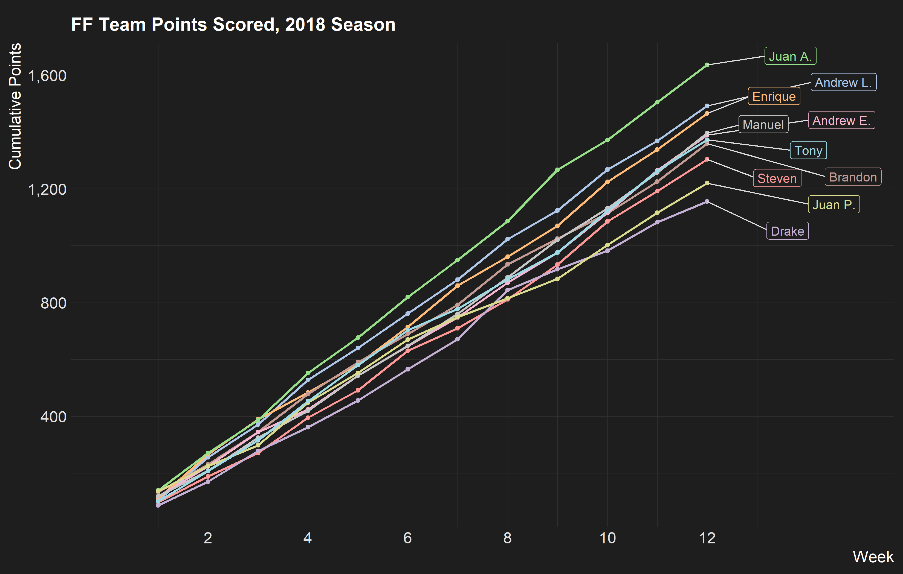
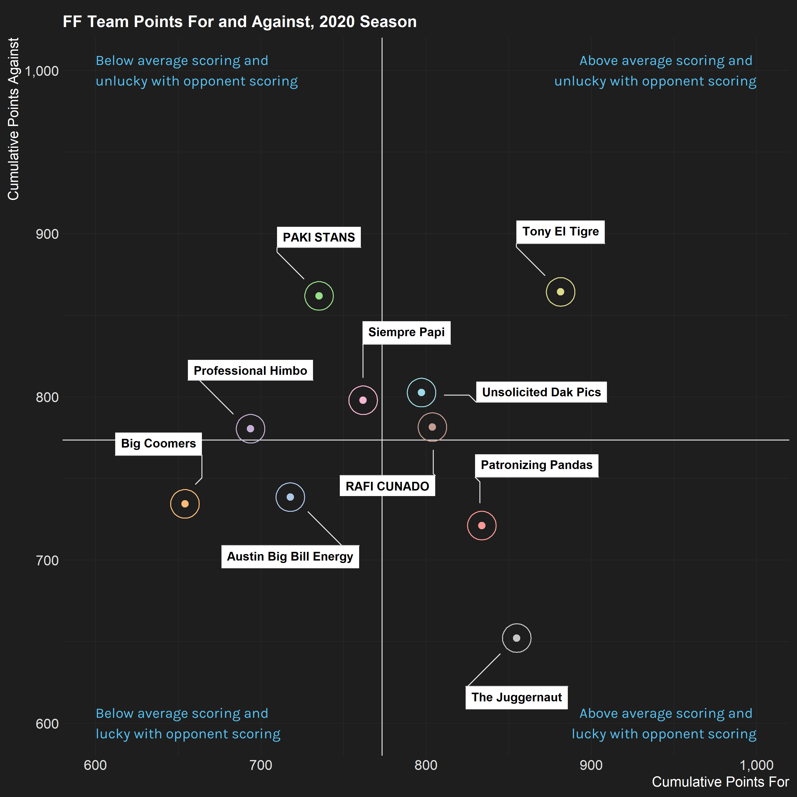

This repo stores some ad-hoc analysis and visualizations of personal fantasy football (FF) data.
Right now, it's only for a public league on ESPN.

## Getting Started

To repeat the same analysis for your own ESPN FF league, you'll need to manually download your league's team and box score information (in JSON format) using the following URL templates (where the curly braces "{}" indicate values to substitute):

+ scores: http://fantasy.espn.com/apis/v3/games/ffl/seasons/{season}/segments/0/leagues/{leagueid}?view=mMatchup&view=mMatchupScore&scoringPeriodId={scoreingPeriodId}

  + For example, I used  the URL http://fantasy.espn.com/apis/v3/games/ffl/seasons/2018/segments/0/leagues/453218??view=mMatchup&view=mMatchupScore&scoringPeriodId=20 to download all of the 2018 season data.
  
+ teams: http://fantasy.espn.com/apis/v3/games/ffl/seasons/{season}/segments/0/leagues/{leagueId}?scoringPeriodId={scoringPeriodId}&view=mRoster&view=mTeam

If you're going to be downloading data from a completed season, then I would recommnend setting the `scoringPeriodId` to a number larger than the last week of the season (including playoffs). I believe that the data returned is the same for any number greater than the number corresponding to the last week of your FF season (so something like `20` should always work).

For whatever reason, I have not been successful in my attempts to send an HTTP request to return the same data (even though the league is "public"). This is why the data needs to be downloaded manually. (If you figure out how to download the data via a request, then please send a pull request.)

## Highlights

Below are some hastily-made visualizations of the 2018 regular season for the "Texas Fantasy Football" league on ESPN. (Yes, it's a super creative name, I know.)

