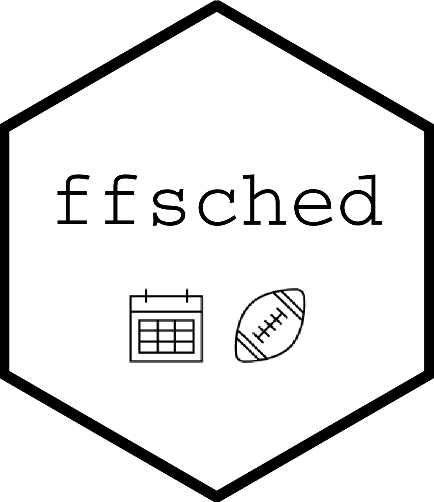

<!-- README.md is generated from README.Rmd. Please edit that file -->

# ffsched <a href='#'></a>

<!-- badges: start -->

[](https://www.tidyverse.org/lifecycle/#experimental)

<!-- badges: end -->

`{ffsched}` can generate unique sports league schedules. If you happen
to have an ESPN fantasy football league, then `{ffsched}` can pull your
league’s scores and help you figure out the likelihood of your standings
by combining teams’ actual scores with simulated schedules. (Often the
team that scores the most points across all games in the season does not
end up winning due to “unlucky” opponent matchups!)

## Installation

You can install the development version of `{ffsched}` from
[GitHub](https://github.com/) with:

``` r
# install.packages("remotes")
remotes::install_github("tonyelhabr/ffsched")
```

## Basic Usage

See the vignette.
