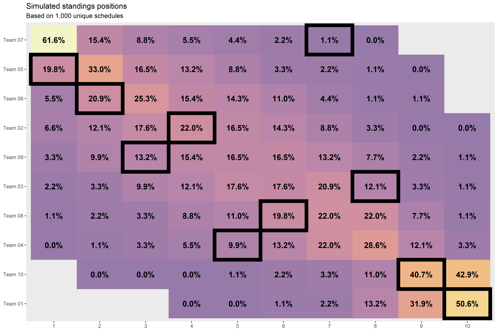

```{r, include = FALSE}
knitr::opts_chunk$set(
  warning = FALSE,
  message = FALSE,
  collapse = TRUE,
  comment = "#>"
)
```

```{r setup}
library(dplyr)
library(magrittr)
library(ffsched)

# Just for plotting
library(ggplot2)
library(forcats)
library(scales)
```

```{r echo=F, include=F}
library(arrow)
library(readr)
```

```{r echo=F, include=F}
options(
  readr.num_columns = 0,
  ffsched.verbose = FALSE
)
```

```{r}
league_id <- 899513
weeks <- 12
league_size <- 10
season <- 2020
sims <- 1000
tries <- 0.1 * sims
```

Simulate `r sims` unique schedules for a `r league_size`-team league for the first `r weeks` weeks. Note that you don't need the `league_id` for this!

```{r eval=F}
set.seed(42) # For repoducibility
sched_sims <-
  generate_schedules(
    league_size = league_size,
    sims = sims,
    tries = tries
  )
```

```{r echo=F, include=F}
sched_sims <- system.file('schedules-league_size=10-weeks=12-sims=1000.parquet', package = 'ffsched') %>% arrow::read_parquet()
```

```{r}
sched_sims
```

Get fantasy football scores from ESPN.

```{r eval=F}
scores <-
  scrape_espn_ff_scores(
    league_id = league_id,
    league_size = league_size,
    season = season,
    weeks = weeks
  )
```

```{r echo=F, include=F}
scores <- system.file('scores-league_id=899513-league_size=10-season=2020-weeks=12.csv', package = 'ffsched') %>% readr::read_csv()
```

```{r}
scores
```

Join the simulated schedules and the actual scores together to come up with simulated standings.

```{r}
anonymize_teams <- function(data) {
  data %>% 
    mutate(
      across(team, ~sprintf('Team %02d', team_id))
    )
}
```

```{r eval=F}
scores_by_team <- scores %>% select(team_id, team, week, pf)

scores_sims <-
  sched_sims %>% 
  left_join(
    scores_by_team,
    by = c('week', 'team_id')
  ) %>% 
  left_join(
    scores_by_team %>% 
      dplyr::rename(opponent_id = .data$team_id, opponent = .data$team, pa = .data$pf),
    by = c('week', 'opponent_id')
  ) %>% 
  mutate(
    w = if_else(pf > pa, 1L, 0L)
  )

standings_sims <-
  scores_sims %>% 
  group_by(idx_sim, team, team_id) %>% 
  summarize(
    across(c(pf, w), sum)
  ) %>% 
  ungroup() %>% 
  group_by(idx_sim) %>% 
  mutate(
    rank_w = min_rank(-w)
  ) %>% 
  ungroup() %>% 
  group_by(idx_sim, rank_w) %>% 
  mutate(
    rank_tiebreak = row_number(-pf) - 1L
  ) %>% 
  ungroup() %>% 
  mutate(rank = rank_w + rank_tiebreak) %>% 
  select(-rank_w, -rank_tiebreak) %>% 
  anonymize_teams()
```

```{r echo=F, include=F}
standings_sims <- system.file('standings_sims-league_id=899513-league_size=10-season=2020-weeks=12-sims=1000.parquet', package = 'ffsched') %>% arrow::read_parquet()
standings_sims <- standings_sims %>% anonymize_teams()
```

```{r}
standings_sims
```

`standings_sims` can be achieved by using the `do_simulate_standings` function, which wraps the functionality demonstrated above.

```{r eval=F}
standings_sims <-
  do_simulate_standings(
    league_id = league_id,
    league_size = league_size,
    season = season,
    weeks = weeks,
    sims = sims,
    tries = tries
  ) %>% 
  anonymize_teams()
```

```{r}
standings_sims
```

Make an interesting plot.

```{r eval=F}
standings_sims_n <-
  standings_sims %>% 
  count(team_id, team, rank, sort = TRUE) %>% 
  group_by(team_id, team) %>% 
  mutate(frac = n / sum(n)) %>% 
  ungroup()
standings_sims_n

standings_sims_n_top <-
  standings_sims_n %>% 
  group_by(rank) %>% 
  slice_max(n, with_ties = FALSE) %>%  
  ungroup()
standings_sims_n_top

standings_sims_n_top <-
  standings_sims_n %>% 
  group_by(team) %>% 
  summarize(
    tot = sum(n),
    rank_avg = sum(rank * n)  / tot
  ) %>% 
  ungroup() %>% 
  mutate(rank_tot = row_number(rank_avg)) %>% 
  arrange(rank_tot)
standings_sims_n_top

standings_actual <-
  scores %>% 
  anonymize_teams() %>% 
  mutate(w = if_else(pf > pa, 1, 0)) %>% 
  group_by(team, team_id) %>% 
  summarize(
    across(c(w, pf), sum)
  ) %>% 
  ungroup() %>% 
  mutate(rank_w = min_rank(-w)) %>% 
  group_by(rank_w) %>% 
  mutate(
    rank_tiebreak = row_number(-pf) - 1L
  ) %>% 
  ungroup() %>% 
  mutate(rank = rank_w + rank_tiebreak)
standings_actual

factor_cols <- function(data) {
  data %>% 
    left_join(
      standings_sims_n_top %>% 
        select(team, rank_tot, rank_avg)
    ) %>% 
    left_join(standings_actual) %>% 
    mutate(
      across(team, ~fct_reorder(.x, -rank_tot)),
      across(rank, ordered)
    )
}

pts <- function(x) {
  as.numeric(grid::convertUnit(grid::unit(x, 'pt'), 'mm'))
}

viz_standings_tile <-
  standings_sims_n %>% 
  factor_cols() %>% 
  ggplot() +
  aes(x = rank, y = team) +
  geom_tile(aes(fill = frac), alpha = 0.5, na.rm = FALSE) +
  geom_tile(
    data = standings_actual %>% factor_cols(),
    fill = NA,
    color = 'black',
    size = 3
  ) +
  geom_text(
    aes(label = percent(frac, accuracy = 1.1)), 
    color = 'black', 
    size = pts(14),
    fontface = 'bold'
  ) +
  scale_fill_viridis_c(option = 'B', begin = 0.2, end = 1) +
  guides(fill = FALSE) +
  theme(
    panel.grid.major = element_blank(),
    panel.grid.minor = element_blank(),
  ) +
  labs(
    title = 'Simulated standings positions',
    subtitle = sprintf('Based on %s unique schedules', comma(sims)),
    x = NULL,
    y = NULL
  )
viz_standings_tile
```

```{r echo=F, include=F, eval=F}
ggsave(
  plot = viz_standings_tile, 
  filename = file.path('viz_standings_tile.png'), 
  type = 'cairo', 
  width = 12,
  height = 8
)
```


